# Multi-Source Inverter (MSI) for Electric Vehicles

A senior capstone project (Ontario Tech University, Electrical Engineering, 2025 to 2026) that designs and prototypes a novel multi-source inverter: a single power electronics board that combines two DC inputs (for example a battery and a solar/auxiliary source) and drives a three-phase AC motor, without the extra switch count that typical multi-source topologies need.

**Team:** Emmanuel Ita, Jack Flann, Dorsheed Abdalla, Badi Daoud
**Project Coordinator:** Dr. Mohamed Z. Youssef, Ontario Tech University

> This repository is my personal, individually maintained record of a four-person team capstone. It documents the project in full and credits every teammate's contribution; it is not a claim of solo authorship. The team's original working repository, maintained by a teammate, is linked in [Attribution](#attribution-and-original-repository) below.

## Table of Contents

- [Problem Statement](#problem-statement)
- [Existing Solutions](#existing-solutions)
- [Project Objectives](#project-objectives)
- [Design Process](#design-process)
- [System Architecture](#system-architecture)
- [Proposed Design](#proposed-design)
- [Hardware and Schematics](#hardware-and-schematics)
- [Final Product](#final-product)
- [Video Demos](#video-demos)
- [Testing and Results](#testing-and-results)
- [Challenges and Root Cause Analysis](#challenges-and-root-cause-analysis)
- [My Contributions](#my-contributions)
- [Project Timeline](#project-timeline)
- [Repository Contents](#repository-contents)
- [Attribution and Original Repository](#attribution-and-original-repository)

## Problem Statement

Electric vehicle inverters today face real limits on efficiency, size, and flexibility:

- Most EV traction inverters run on a single DC source, which restricts controllability and limits adaptability across operating conditions.
- Efficiency drops significantly at partial loads, which is most of real-world driving, directly impacting vehicle range.
- Modern EV systems increasingly need to combine multiple DC sources (battery cells, PV modules, auxiliary supplies) and reconfigure them dynamically.
- Existing multi-source inverter (MSI) topologies in the literature solve this, but usually at the cost of high switch counts, added control circuitry, and a larger form factor.

The goal of this project was to design an MSI that keeps the benefits of multi-source operation (dynamic voltage combining, source flexibility) while cutting down the component count, board footprint, and cost that usually come with it.

## Existing Solutions

We reviewed the landscape before designing our own approach:

- Conventional 2-level and 3-level NPC inverters with a single DC input: good performance, but high switching losses and no source flexibility.
- PWM/SPWM control: simple and widely used, but DC-bus utilization tops out around 78% with significant harmonic distortion.
- SVPWM control: better DC-bus utilization (over 90%) and lower distortion, but still tied to a single fixed-voltage DC link.
- Two-input MSI topologies from the literature: allow dynamic voltage combining, but require many switches, which increases complexity, size, and cost.
- Source-combination strategies each have a tradeoff: parallel combination needs identical sources and limits voltage flexibility, series combination risks source imbalance and voltage jumps, and switched MSI structures add control complexity and don't scale well past two sources.

No market solution currently exists for this exact combination of goals; reconfigurable EV battery packs exist, but they switch a single battery system between series and parallel, not multiple independent sources into one inverter stage.

## Project Objectives

Six requirements, tied directly to the problem above, drove every design decision:

- Design a novel multi-source input stage
- Minimize component count
- Develop a PCB with a minimal footprint
- Meet safety requirements
- Meet a $800 budget
- Minimize harmonic distortion

## Design Process

We followed an iterative engineering workflow: problem definition, requirement specification, research on existing solutions, concept generation, PSIM simulation, conceptual system design, PCB layout, firmware design, and testing and evaluation, cycling back through simulation and system design as results came in.

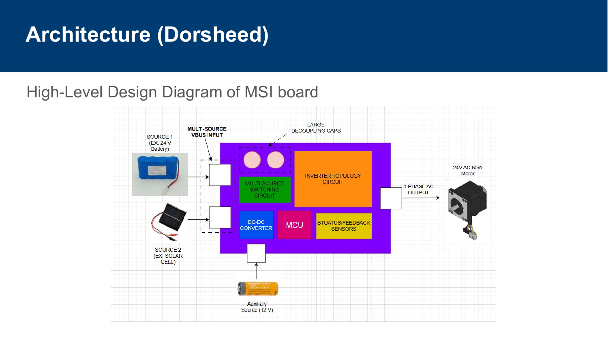
*High-level design diagram of the MSI board: two DC sources plus an auxiliary 12V supply feed a multi-source switching circuit and DC-DC converter, controlled by an STM32 MCU, driving a 2-level inverter topology out to a three-phase AC motor.*

Field-Oriented Control (FOC) was chosen as the motor control strategy: a closed-loop scheme that maximizes the motor's quadrature (rotational) force by continuously measuring output currents and rotor position and adjusting switching accordingly.

## Proposed Design

Our novel MSI design combines two DC battery inputs in parallel through a switched front end, which:

- Merges multiple DC inputs safely into a shared DC bus (12, 24, or 36V depending on configuration)
- Minimizes component count relative to literature MSI topologies
- Supports multiple voltage levels and can scale up toward a full-size system
- Uses diodes in the prototype (for a full-scale version, these would be replaced with actively controlled IGBTs or SiC MOSFETs)

The main design risks we identified going in were shoot-through during switching (which can cause extensive damage) and the need for tight current control during source-mode transitions, both of which turned out to matter later during hardware testing (see [Challenges and Root Cause Analysis](#challenges-and-root-cause-analysis)).

## Hardware and Schematics

The board is organized into six subsections: multi-source input switching, auxiliary input power, a DC-DC/voltage regulation stage, an STM32/ESP32-class microcontroller for control, a 2-level inverter topology stage (gate drivers plus MOSFETs), and feedback sensors (current, voltage, and speed sensing) for closed-loop control. The full KiCad source for each sheet below lives in [`hardware/kicad/`](hardware/kicad/); everything here was individually recreated in KiCad after the original board's PCB order came back defective (see [Challenges and Root Cause Analysis](#challenges-and-root-cause-analysis)).

<table>
<tr>
<td>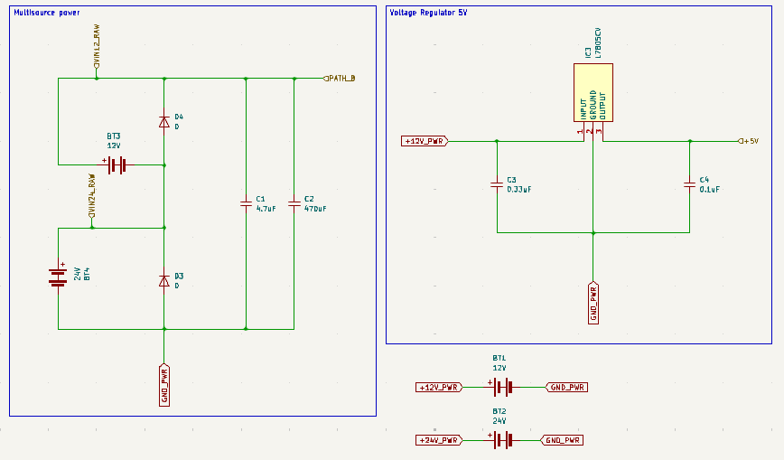</td>
<td>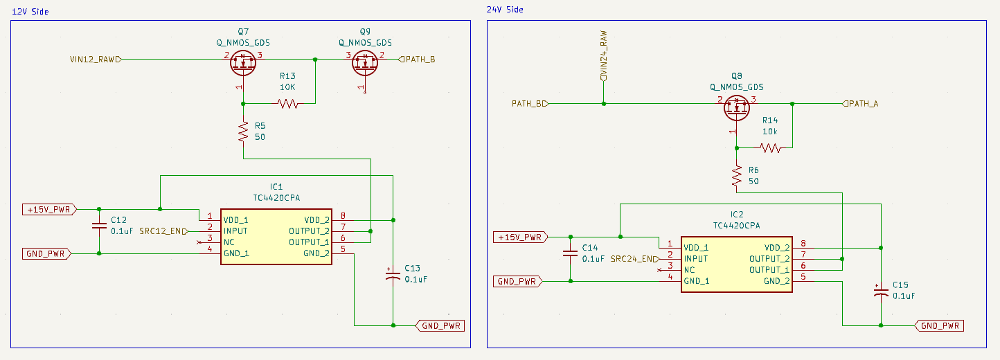</td>
</tr>
<tr>
<td align="center"><em>Power sheet: 12V/24V multi-source battery inputs and 5V linear regulator (<a href="hardware/kicad/Power.kicad_sch">Power.kicad_sch</a>)</em></td>
<td align="center"><em>Multi-source path switching (12V/24V side MOSFET switching into PATH_A/PATH_B). Source file for this sheet was not part of this export; screenshot only.</em></td>
</tr>
<tr>
<td>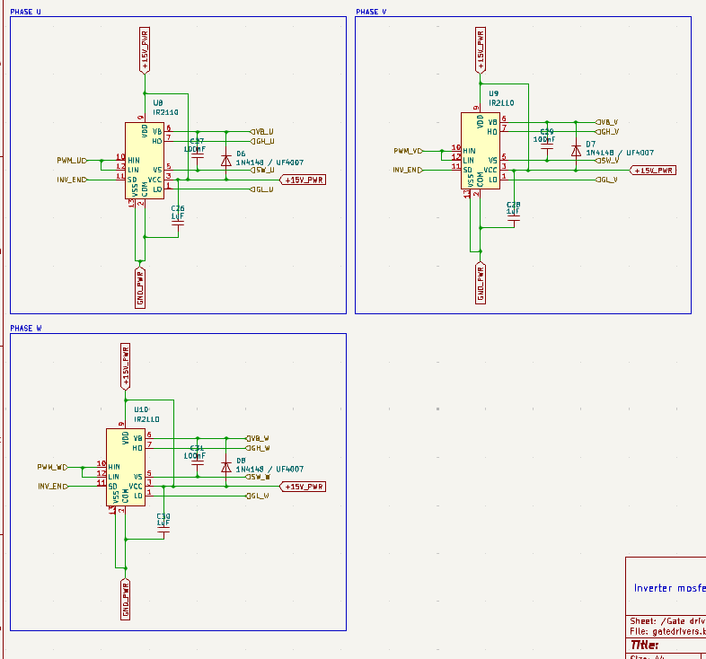</td>
<td>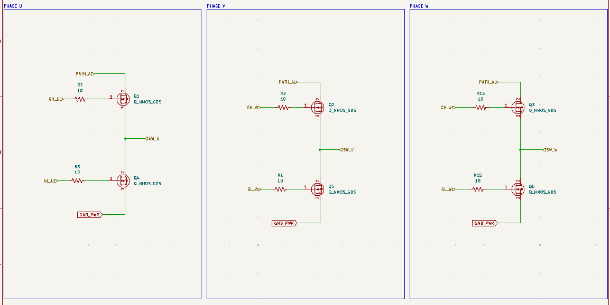</td>
</tr>
<tr>
<td align="center"><em>Gate drivers: IR2110/IR2LLO high/low-side drivers per phase (<a href="hardware/kicad/gatedrivers.kicad_sch">gatedrivers.kicad_sch</a>)</em></td>
<td align="center"><em>2-level inverter MOSFET stage, phases U/V/W (<a href="hardware/kicad/inverters.kicad_sch">inverters.kicad_sch</a>)</em></td>
</tr>
<tr>
<td>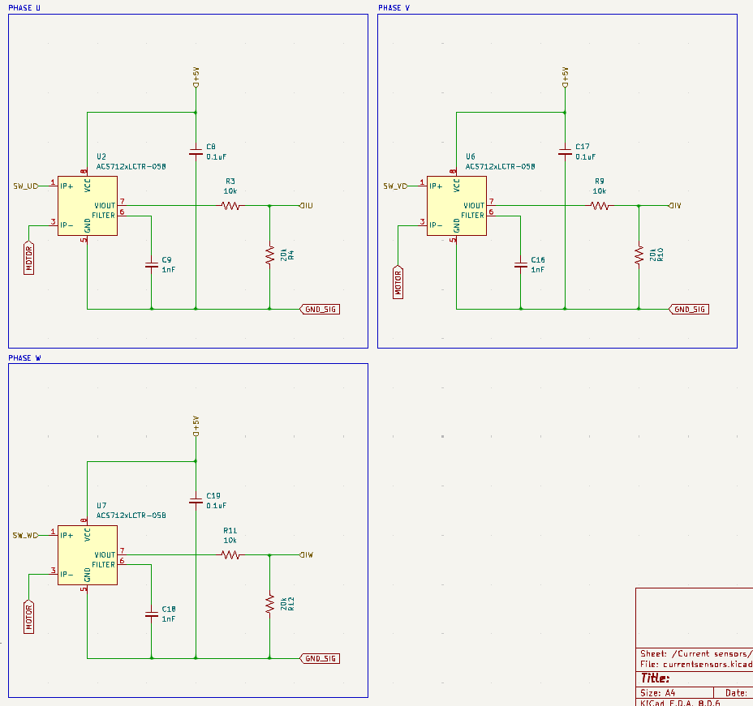</td>
<td>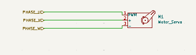</td>
</tr>
<tr>
<td align="center"><em>Per-phase current sensing with ACS712 Hall-effect sensors (<a href="hardware/kicad/currentsensors.kicad_sch">currentsensors.kicad_sch</a>)</em></td>
<td align="center"><em>Motor output connector (<a href="hardware/kicad/motor.kicad_sch">motor.kicad_sch</a>)</em></td>
</tr>
</table>

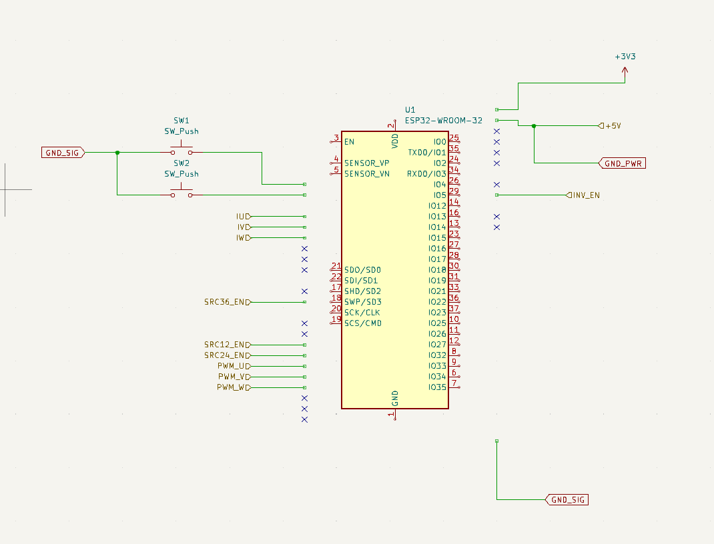

*Microcontroller sheet (<a href="hardware/kicad/MCU.kicad_sch">MCU.kicad_sch</a>). This sheet was not finished by the end of the capstone; it's included as a work in progress, not a completed design.*

The top-level sheet tying everything together is [`hardware/kicad/MSI.kicad_sch`](hardware/kicad/MSI.kicad_sch). Note the PCB layout itself (copper routing, footprints) was not completed in KiCad due to time constraints; the [Final Product](#final-product) PCB images below are from the original Altium-based board.

Additional schematic sections (connectors, DC-DC converter details) are also captured slide-by-slide in the demo presentation under [`docs/presentations/`](docs/presentations/).

## Final Product

<table>
<tr>
<td>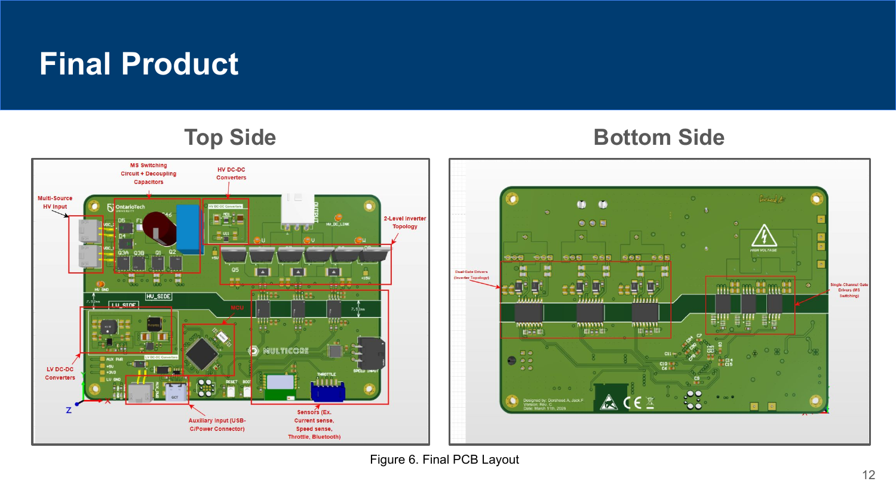</td>
<td>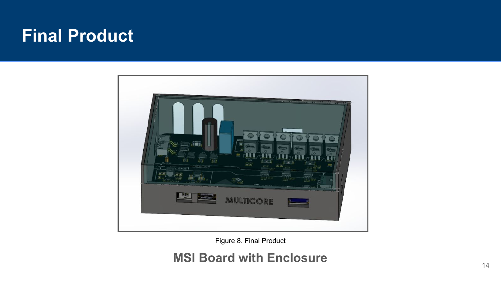</td>
</tr>
<tr>
<td align="center"><em>Final PCB layout (top and bottom copper)</em></td>
<td align="center"><em>Final board with enclosure, ready for demo</em></td>
</tr>
</table>

## Video Demos

<table>
<tr>
<td><a href="https://youtu.be/wHL-Usw2PE0"></a></td>
<td><a href="https://www.youtube.com/watch?v=NoywARZFs50"></a></td>
</tr>
<tr>
<td align="center"><a href="https://youtu.be/wHL-Usw2PE0">Team capstone working demo</a></td>
<td align="center"><a href="https://www.youtube.com/watch?v=NoywARZFs50">My individual KiCad prototype walkthrough</a></td>
</tr>
</table>

## Testing and Results

Testing moved from individual component validation up to full integration:

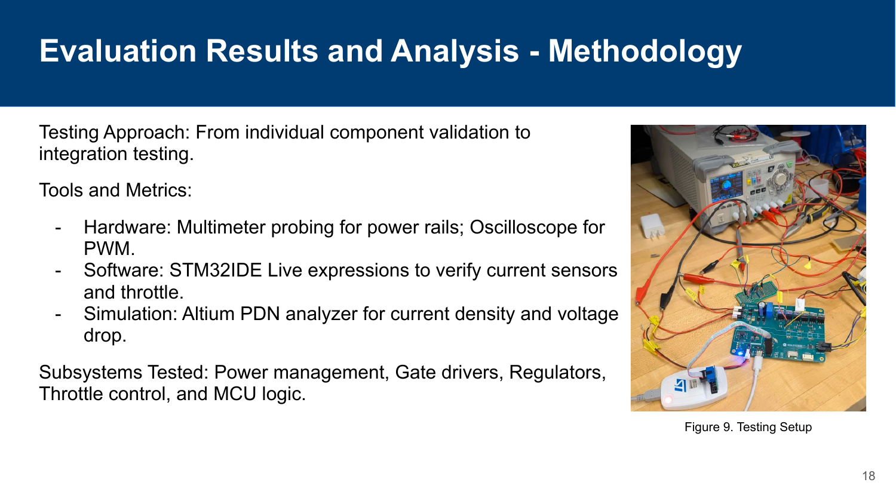
*Bench testing setup: multimeter probing on power rails, oscilloscope on PWM outputs, STM32IDE live expressions for current sensors and throttle, and Altium's PDN analyzer for current density and voltage drop in simulation.*

Being upfront about the outcome is part of the point of documenting this project:

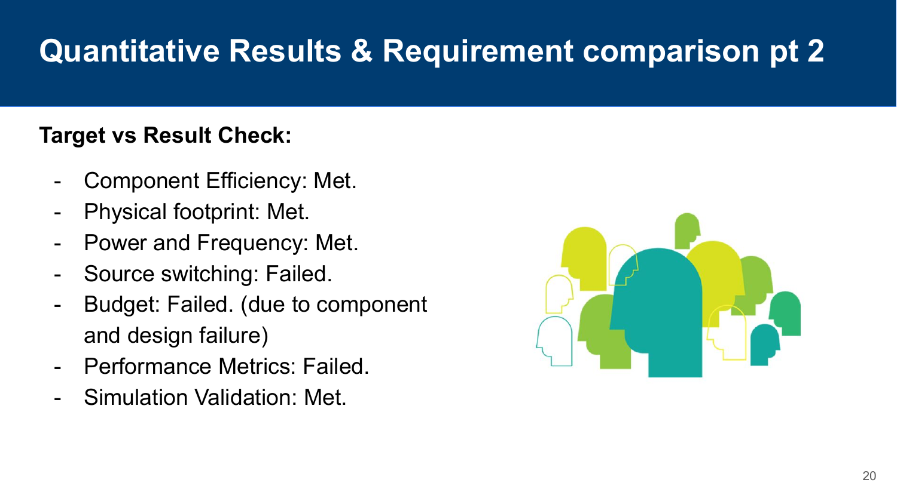

| Requirement | Result |
|---|---|
| Component efficiency | Met |
| Physical footprint | Met |
| Power and frequency | Met |
| Simulation validation | Met |
| Source switching | Not met |
| Performance metrics | Not met |

**Note on source switching:** my individual KiCad prototype did successfully implement source switching. The "Not met" result above traces back to a routing error in the original PSIM schematic, which carried through to the team's final Altium design: the MOSFETs were not placed correctly relative to the routing, which prevented the final board from switching between sources.

## Challenges and Root Cause Analysis

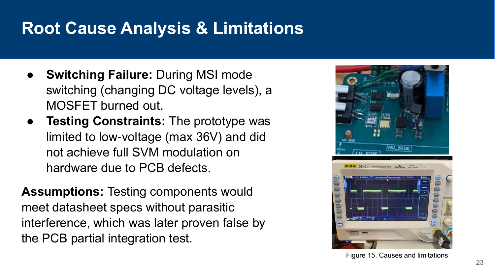

The two biggest issues we ran into on hardware:

- **Switching failure:** during MSI mode switching (changing DC voltage levels), a MOSFET burned out. Our working assumption, that components would meet datasheet specs without parasitic interference, turned out to be false once we ran the partial integration test.
- **Testing constraints:** the prototype was limited to low voltage (36V max) and didn't reach full SVM modulation on hardware, because of PCB defects rather than a control-algorithm limitation.

We also worked through a PCB design defect, early Bluetooth/USB-C communication issues, a DC-DC converter fault, firmware bring-up, circuit shorts, and undersized fusing, upgrading from a 5A to a 10A fuse after the first hardware iteration.

## My Contributions

My individual work on the team covered:

- Owned and presented the **Project Timeline** section of the demo (see [`docs/presentations/`](docs/presentations/)) and contributed to the team's overall project management plan (see [Project Timeline](#project-timeline) below).
- When our ordered PCB arrived with a defect, rebuilt the schematic in KiCad after running into an Altium compatibility issue on my end.
- Diagnosed a missing back-EMF protection component as the root cause of a voltage-drop issue on the board.
- Worked around the faulty ordered board by bringing up control on a standalone STM32 dev board so testing and firmware validation could continue in parallel with the hardware fix.

The team placed 3rd at the Capstone Design Annual Exhibition, despite the working prototype not being fully functional at demo time, on the strength of the design, documentation, and root-cause analysis.

## Project Timeline

The project ran on a 12-phase plan from initiation in September 2025 through the Capstone Design Annual Exhibition. See [`docs/planning/`](docs/planning/) for the full team project management plan (exported from MS Project) alongside a condensed summary. Major phases:

| Phase | Start | Duration |
|---|---|---|
| Initiation & Scoping | Sep 8, 2025 | 14 days |
| Requirements & Planning | Sep 22, 2025 | 13 days |
| Simulation & R1 Report | Oct 5, 2025 | 6 days |
| Conceptual Design & R2 Report | Oct 10, 2025 | 22 days |
| Prototyping & Presentation (Demo) | Nov 1, 2025 | 21 days |
| Team Retrospective Report | Nov 22, 2025 | 11 days |
| Preparations for Prototype | Dec 2, 2025 | 30 days |
| Prototype Development | Jan 5, 2026 | 36 days |
| Design and Testing Report | Jan 26, 2026 | 19 days |
| Acceptance Testing Report | Feb 9, 2026 | 26 days |
| Team Presentation & Video Clip | Mar 9, 2026 | 15 days |
| Final Engineering Report | Mar 13, 2026 | 8 days |
| Capstone Design Annual Exhibition | Mar 16, 2026 | 12 days |

## Repository Contents

```
.
├── README.md
├── assets/                      Figures used in this README
│   └── schematics/               Per-sheet schematic screenshots
├── hardware/
│   └── kicad/                    KiCad source (.kicad_sch), recreated after the original PCB order
│                                  came back defective. No PCB layout (.kicad_pcb) yet.
└── docs/
    ├── presentations/
    │   ├── Capstone-Demo-Presentation.pdf     Mid-project demo deck
    │   └── Capstone-Final-Presentation.pdf    Final results and demo deck
    └── planning/
        ├── Project-Management-Plan-Full.pdf       Detailed Gantt chart (initiation through demo)
        ├── Project-Management-Plan-Summary.pdf    Full-year phase summary
        └── Project-Management-Plan-Sections.pdf    Mid-project planning excerpt
```

The multi-source path-switching sheet and PSIM simulation files, plus the original Altium PCB layout, live in the team's original repository and may be added here over time as a personal archive.

## Attribution and Original Repository

This was a four-person team capstone project for Ontario Tech University, supervised by Dr. Mohamed Z. Youssef. The team's active working repository, including full source and design files, is maintained by teammate Dorsheed Abdalla:

**[github.com/dorsheed455k/MSI-Capstone](https://github.com/dorsheed455k/MSI-Capstone)**

This repository exists as my own record of the project and my contributions to it, built from the presentations and project management documentation I have on hand.
